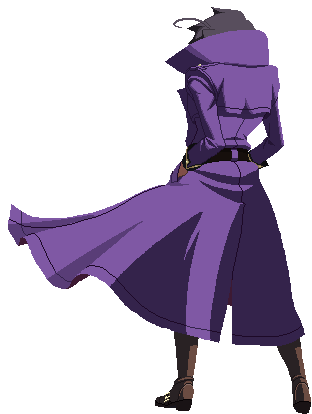

<!-- ================= HEADER ================= -->

  

<h1 align="center">👨‍💻 Web Engineer | Full Stack Developer</h1>

  Membangun sistem web yang <b>logis</b>, <b>efisien</b>, dan <b>siap dipakai dunia nyata</b>.

---
##### <h1 align="center">👨‍💻 SKILLS</h1>

	
  	
    
    	
      
      	
        
        	
          
          
          
          
          
          
          	
            
            	
              
              
              
              	
                	
                  
                  
                  
                  
                  	
                    
                    
                    	
                      	
                        	
                          

## 🚀 About Me

<table border="0" cellspacing="0" cellpadding="0" style="border:none;">
  <tr>
    <td width="45%" align="center" style="border:none;">
      
    </td>
    <td width="55%" style="border:none;">

Saya seorang **Web Engineer** dengan fokus pada **Full Stack Development**.  
Tidak sekadar membuat web “jalan”, tapi memastikan **alur data, struktur kode, dan skalabilitas** masuk akal.

🎯 Prinsip kerja:
- Kode harus bisa dibaca manusia, bukan cuma mesin  
- Solusi sederhana > solusi ribet tapi rapuh  
- Sistem yang baik = minim drama di masa depan  

</td>
</tr>
</table>

---

## 🧠 What I Do

<table border="0">
<tr>
<td width="55%">

🔧 **Full Stack Development**
- Membangun frontend yang responsif & terstruktur  
- Merancang backend yang stabil dan mudah dikembangkan  
- Integrasi API & database secara efisien  

🧩 **Problem Solving**
- Memecah masalah kompleks jadi langkah logis  
- Fokus ke akar masalah, bukan tambal sulam  

</td>
<td width="45%" align="center">
  
</td>
</tr>
</table>

---

## 🛠 Tech Stack

Frontend : HTML | CSS | JavaScript
Backend : Node.js | PHP
Database : MySQL
Tools : Git | GitHub | Linux

📦 Pendekatan:
- Modular  
- Reusable  
- Maintainable  

---

## 📚 Currently Learning

🌱 Fokus pengembangan diri saat ini:
- Pendalaman **arsitektur backend**
- Clean Code & best practice
- Optimasi workflow development

Belajar bukan buat gaya, tapi buat **naik level**.

---

## 📂 Featured Projects

📌 Beberapa tipe project yang saya kerjakan:
- Web profile & landing page
- Sistem berbasis database
- Web app sederhana tapi fungsional

> Detail project bisa dilihat di repository saya.

---

## 🤝 Open For

- Kolaborasi project web  
- Freelance job  
- Diskusi teknis (selama ada tujuan jelas)

---

## 📫 Contact

📍 GitHub : [@ilhammu29](https://github.com/ilhammu29)

---

  <i>Build with logic. Improve relentlessly.</i>

