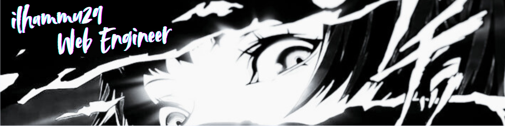
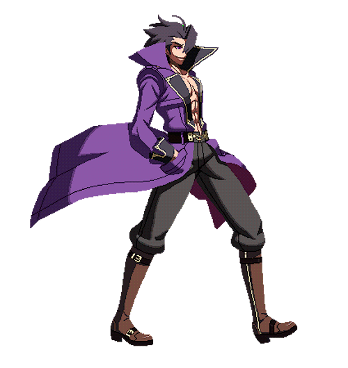

  

<h1 align="center">Hi there, I'm Ilham! 👋</h1>
<h3 align="center">👨‍💻 Product-Minded Web Engineer | SaaS & B2B Tech Builder</h3>

> 💡 **Engineering Philosophy:** *"Code is read more often than it is written."* > Fokus saya adalah membangun ekosistem digital dan perangkat lunak yang **logis, *scalable*, dan berorientasi pada penyelesaian masalah bisnis**.

 

<table border="0" cellpadding="0" cellspacing="0" width="100%">
  <tr>
    <td width="50%" valign="top">
      <h3>🚀 The Builder Mindset</h3>
      
Saya bukan sekadar menulis kode, tapi merancang arsitektur sistem yang menyelesaikan masalah di dunia nyata. Saya memiliki minat khusus pada pengembangan aplikasi <b>B2B, ekosistem manajemen instansi, dan integrasi AI</b>.

      <b>🎯 Prinsip Kerja:</b>
      <ul>
        <li><b>Product-Led:</b> Solusi teknis harus sejalan dengan kebutuhan bisnis.</li>
        <li><b>Clean Architecture:</b> Solusi elegan & rapi > arsitektur rumit tapi rapuh.</li>
        <li><b>Scalability:</b> Desain *database* yang siap menampung lonjakan data tanpa drama di masa depan.</li>
      </ul>
    </td>
    <td width="50%" valign="top" align="center">
      
    </td>
  </tr>
</table>

---

## 🗂️ Active Ventures & Project Board

Selayaknya *Notion Workspace*, berikut adalah *high-level view* dari produk dan sistem yang saat ini sedang saya kembangkan:

| 🚥 Status | 📦 Project Name | 🏷️ Category | 🛠️ Core Tech / Focus | 🎯 Key Features |
| :---: | :--- | :--- | :--- | :--- |
| 🟢 **Building** | **Digital School Ecosystem** | B2B / EdTech | Full Stack, Relational DB | 21+ modul terintegrasi (manajemen finansial, rapor otomatis, profil sekolah). |
| 🟡 **Polishing** | **Psychometric App** | Assessment App | Web Platform, Security | Sistem *testing* untuk asesmen MMPI & ADHD, kalkulasi *scoring* otomatis. |
| 🔵 **Prototyping**| **Automated AI Venture Builder** | Internal Tool / AI | Multi-Agent, Vector DB | Orkestrasi AI, Redis, ChromaDB untuk percepatan *deployment* produk. |

📂 <b><i>(Click to expand)</i> Lihat detail arsitektur & pendekatan teknis</b>

 
  
Pendekatan saya pada *project* di atas berfokus pada **Modularitas dan Reusability**. Setiap fitur (seperti modul finansial siswa atau sistem skoring psikotes) dibangun dengan alur logika yang dipecah menjadi komponen mandiri, sehingga mudah di-*maintain* dan di-*scale* ketika ada penambahan fitur baru di masa depan.
  

---

## 🛠️ Tech Stack & Arsenal

Peralatan tempur yang saya gunakan untuk merancang logika dan membangun produk yang berfungsi penuh:

<table border="0" cellpadding="0" cellspacing="0" width="100%">
  <tr>
    <td width="30%" valign="top">
      <b>🌐 Frontend & UI</b>
    </td>
    <td width="70%" valign="top">
      
      
      
      
      
      
      
      
    </td>
  </tr>
  <tr>
    <td width="30%" valign="top">
      <b>⚙️ Backend, DB & AI</b>
    </td>
    <td width="70%" valign="top">
      
      
      
      
      
      
      
      
    </td>
  </tr>
  <tr>
    <td width="30%" valign="top">
      <b>🖥️ Infra & DevOps</b>
    </td>
    <td width="70%" valign="top">
      
      
      
      
      
      
    </td>
  </tr>
  <tr>
    <td width="30%" valign="top">
      <b>🧰 Tools & Workspace</b>
    </td>
    <td width="70%" valign="top">
      
      
      
      
      
    </td>
  </tr>
</table>

---

## 📚 Continuous Learning

<table border="0" cellpadding="0" cellspacing="0" width="100%">
  <tr>
    <td width="40%" align="center" valign="middle">
      
    </td>
    <td width="60%" valign="top">
      Membangun produk dengan standar tinggi menuntut pembaruan ilmu yang konstan. Saat ini saya sedang intens mengeksplorasi:  
      🌱 <b>Fokus Saat Ini:</b>
      <ul>
        <li><b>Modern JavaScript Ecosystem:</b> Transisi dan penguasaan <b>T3 Stack</b> (MERN / Next.js, Prisma, Tailwind) untuk <i>rapid product development</i>.</li>
        <li><b>System Architecture:</b> Pendalaman <i>design patterns</i> dan optimasi <i>query</i> database.</li>
        <li><b>Business & Tech Sync:</b> Mengawinkan keahlian teknis dengan negosiasi B2B untuk meluncurkan SaaS yang bernilai jual tinggi.</li>
      </ul>
    </td>
  </tr>
</table>

---

## 🤝 Let's Collaborate!

Saya selalu terbuka untuk diskusi teknis, kolaborasi proyek, atau peluang *tech partnership* (terutama di bidang pengembangan perangkat lunak B2B dan pendidikan).

  
  

 

  <i>"Write logic. Build systems. Deliver value."</i>

